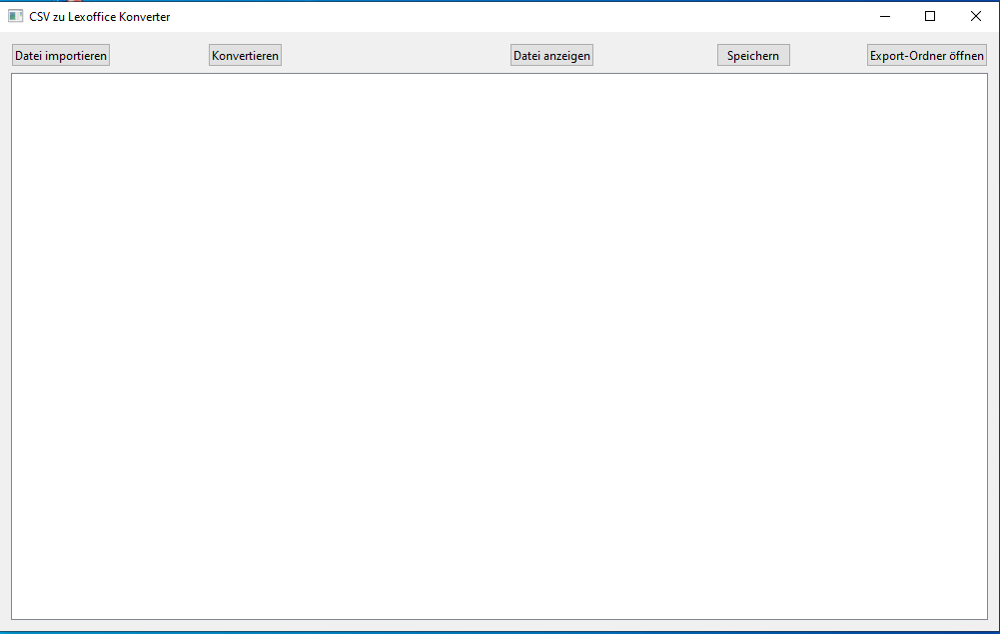

# CSV to LEX Converter

Ein benutzerfreundlicher Konverter, der Volksbank-Exportdateien (CSV) in das Lexoffice-Importformat umwandelt. Verfügbar als grafische Benutzeroberfläche (GUI)

## 📋 Inhaltsverzeichnis

- [Features](#-features)
- [Voraussetzungen](#-voraussetzungen)
- [Installation](#-installation)
  - [Windows 10/11](#windows-1011)
  - [Debian/Ubuntu/Mint](#debianubuntumint)
- [Verwendung](#-verwendung)
- [Häufige Fragen](#-häufige-fragen)
- [Lizenz](#-lizenz)

## ✨ Features

- 🔄 **Automatische Konvertierung**: Wandelt Volksbank-CSV-Dateien nahtlos in das Lexoffice-Format um
- 📊 **Vorschau-Funktion**: Zeigt konvertierte Daten vor dem Export an
- ✏️ **Manuelle Bearbeitung**: Möglichkeit, Daten direkt in der Tabelle zu bearbeiten
- 📁 **Einfacher Export**: Konvertierte Dateien werden direkt im Export-Ordner gespeichert



## 📦 Voraussetzungen

**Unterstützte Betriebssysteme:**
- Windows 10/11
- Debian 10 (Buster) oder höher
- Ubuntu 20.04 LTS (Focal) oder höher
- Linux Mint 20 (Ulyana) oder höher

**Systemanforderungen:**
- **Für .deb/.exe Pakete:** Keine zusätzliche Software erforderlich (Standalone-Anwendung)
- **Für Installation aus Quellcode:** Python 3.6 oder höher, PySide6, pandas

## 🚀 Installation

### Windows 10/11

1. Laden Sie die neueste Windows-Version aus den [Releases](https://github.com/3ddruck12/CSVtoLEX-Converter/releases) herunter
2. Entpacken Sie die ZIP-Datei
3. Führen Sie die `gui.exe` aus dem entpackten Ordner aus (Doppelklick auf die Datei)

**Hinweis:** Bei Windows Defender-Warnungen klicken Sie auf "Weitere Informationen" und dann auf "Trotzdem ausführen".

### Debian/Ubuntu/Mint

**Option 1: Debian-Paket (.deb) - Empfohlen**

**Erstinstallation:**
1. Laden Sie das neueste `.deb`-Paket aus den [Releases](https://github.com/3ddruck12/CSVtoLEX-Converter/releases) herunter
2. Installieren Sie das Paket:
```bash
sudo dpkg -i csv-konverter.deb
```
3. Falls Abhängigkeiten fehlen, installieren Sie diese mit:
```bash
sudo apt-get install -f
```

**Update auf eine neuere Version:**
1. Laden Sie die neue `.deb`-Datei herunter
2. Installieren Sie die neue Version (ersetzt automatisch die alte):
```bash
sudo dpkg -i csv-konverter.deb
sudo apt-get install -f  # Falls nötig
```
Die neue Version ersetzt automatisch die alte Installation.

**Anwendung starten:**
- Über das Anwendungsmenü: Suchen Sie nach "CSV Konverter"
- Oder im Terminal:
```bash
csv-konverter
```

**Option 2: Ausführbare Datei**

1. Laden Sie die Linux-Version aus den [Releases](https://github.com/3ddruck12/CSVtoLEX-Converter/releases) herunter
2. Entpacken Sie das Archiv
3. Machen Sie die Datei ausführbar:
```bash
chmod +x dist/gui
```
4. Führen Sie die Anwendung aus:
```bash
./dist/gui
```

## 💻 Verwendung

### Schritt-für-Schritt-Anleitung

**1. Anwendung starten**

- **Windows:** Doppelklick auf `gui.exe` im entpackten Ordner
- **Linux:** Über das Anwendungsmenü oder Terminal-Befehl `csv-konverter`

**2. CSV-Datei importieren**

- Klicken Sie auf den Button **"Datei importieren"**
- Wählen Sie Ihre Volksbank-Exportdatei (CSV-Format) aus
- Die Datei wird geladen und ist bereit für die Konvertierung

**3. Konvertierung durchführen**

- Klicken Sie auf den Button **"Konvertieren"**
- Die Konvertierung wird automatisch durchgeführt
- Sie erhalten eine Bestätigungsmeldung, wenn die Konvertierung abgeschlossen ist

**4. Ergebnis anzeigen und bearbeiten**

- Klicken Sie auf **"Datei anzeigen"**, um die konvertierten Daten in einer Tabelle zu sehen
- Sie können die Daten direkt in der Tabelle bearbeiten, falls Anpassungen nötig sind
- Die Spalten entsprechen dem Lexoffice-Importformat

**5. Speichern**

- Nach der Bearbeitung (oder direkt) klicken Sie auf **"Speichern"**
- Die Datei wird als `lexoffice_export.csv` im Export-Ordner gespeichert

**6. Export-Ordner öffnen**

- Klicken Sie auf **"Export-Ordner öffnen"**, um den Ordner mit der konvertierten Datei im Dateimanager zu öffnen
- Die Datei kann nun direkt in Lexoffice importiert werden

### Tipps

- Die konvertierte Datei wird immer als `lexoffice_export.csv` im `Export/`-Verzeichnis gespeichert
- Sie können mehrere Dateien nacheinander konvertieren
- Bearbeitungen in der Tabelle werden erst nach Klick auf "Speichern" übernommen

## ❓ Häufige Fragen

**Welche CSV-Dateien werden unterstützt?**
- Das Tool wurde speziell für Volksbank-Exportdateien entwickelt. Andere Bankformate können möglicherweise funktionieren, sind aber nicht getestet.

**Wo wird die konvertierte Datei gespeichert?**
- Die Datei wird als `lexoffice_export.csv` im Verzeichnis `~/csvtolex/Export/` gespeichert (im Home-Verzeichnis des Benutzers).
- Die Import/Export-Ordner werden automatisch beim ersten Start erstellt.

**Kann ich die konvertierten Daten bearbeiten?**
- Ja, nach dem Klicken auf "Datei anzeigen" können Sie alle Daten direkt in der Tabelle bearbeiten. Vergessen Sie nicht, auf "Speichern" zu klicken.

**Was passiert, wenn die Konvertierung fehlschlägt?**
- Überprüfen Sie, ob die CSV-Datei das richtige Format hat (Volksbank-Export). Stellen Sie sicher, dass die Datei nicht beschädigt ist und alle erforderlichen Spalten enthält.

**Funktioniert das Tool mit anderen Buchhaltungsprogrammen?**
- Das Tool konvertiert speziell in das Lexoffice-Format. Für andere Programme müsste das Format angepasst werden.

## 📝 Lizenz

Dieses Projekt ist unter der MIT-Lizenz lizenziert.

## 🤝 Beitragen

Beiträge sind willkommen! Bitte erstellen Sie einen Pull Request oder öffnen Sie ein Issue für Fehlerberichte und Feature-Anfragen.

## 📧 Kontakt

Bei Fragen oder Problemen öffnen Sie bitte ein Issue im [GitHub Repository](https://github.com/3ddruck12/CSVtoLEX-Converter/issues).

---

**Hinweis:** Dieses Tool wurde speziell für die Konvertierung von Volksbank-Exportdateien entwickelt. Bei anderen Bankformaten können Anpassungen erforderlich sein.
